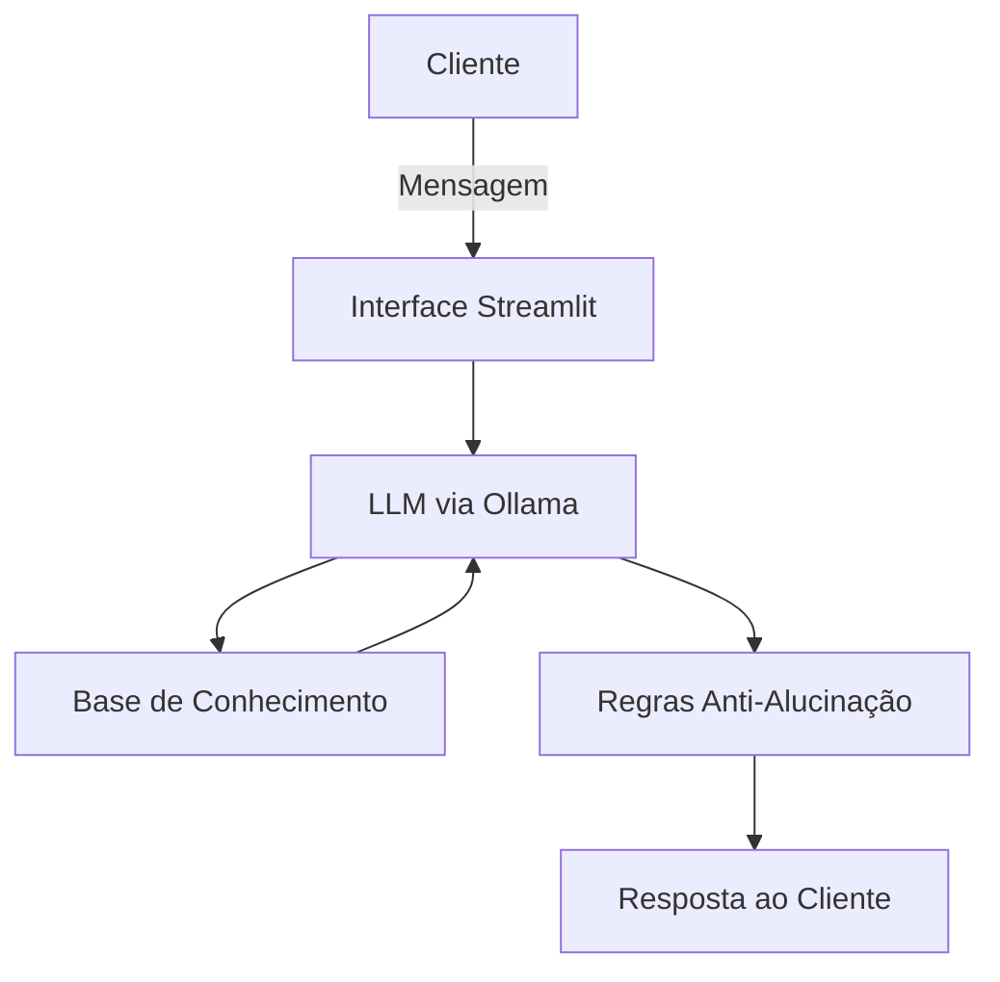

# Lara — Sua Organizadora Financeira

> Um agente de IA generativa que ajuda pessoas comuns a entenderem para onde vai o próprio dinheiro — sem julgamento, sem jargão e sem empurrar investimento nenhum.

---

## 🧠 A ideia por trás da Lara

A maioria das pessoas não tem dificuldade em *ganhar* dinheiro, tem dificuldade em **entender onde ele foi parar**. Contas de luz, PIX aleatório, fatura de cartão que sempre "surpreende" — a origem dos gastos costuma ser um mistério.

A Lara nasceu para resolver exatamente isso: um agente **consultivo e educativo**, que categoriza gastos, explica investimentos (sem recomendar nenhum) e trata cada pessoa como alguém capaz de organizar sua própria vida financeira — do iniciante completo ao mais experiente.

Ela não é uma consultora de investimentos. Ela é a amiga que te ajuda a entender a sua própria planilha.

---

## 🗣️ Quem é a Lara

| | |
|---|---|
| **Personalidade** | Consultiva, cordial, didática — como um professor que nunca julga |
| **Tom de voz** | Formal, acessível e empático |
| **O que ela faz** | Categoriza gastos, explica produtos financeiros, ajuda a planejar metas |
| **O que ela nunca faz** | Recomendar um investimento específico, acessar dados sensíveis, substituir um profissional certificado |

**Exemplo de como ela fala:**

> **Usuário:** Onde posso investir uma sobra do meu dinheiro?
>
> **Lara:** Não posso te dizer *onde* investir, mas posso te mostrar os tipos de investimento que existem e como cada um funciona. Assim você decide com mais segurança.

---

## 🏗️ Arquitetura



| Camada | Tecnologia |
|---|---|
| Interface | [Streamlit](https://streamlit.io/) |
| Modelo | Ollama (`gpt-oss`, local) |
| Base de conhecimento | JSON/CSV em `data/` |
| Validação | Regras de escopo e checagem de fatos no prompt |

---

## 📚 Base de conhecimento

A Lara enxerga o cliente através de dados mockados que simulam uma vida financeira real:

| Arquivo | O que dá pra Lara |
|---|---|
| `transacoes.csv` | Padrão de gastos gerais |
| `transacoes_cartao.csv` | Padrão de gastos no cartão de crédito |
| `historico_atendimento.csv` | Contexto de conversas anteriores |
| `perfil_investidor.json` | Perfil e metas do cliente |
| `produtos_financeiros.json` | Catálogo de produtos para fins **educativos** |
| `base_conhecimento_investimentos.json` | Explicações detalhadas de cada tipo de investimento, com fonte |

> Em relação ao template original, expandi essa base incluindo um dataset de **gastos de cartão de crédito** (o foco da Lara é justamente organização financeira do dia a dia) e adicionei o **Fundo Imobiliário (FII)** à lista de produtos explicados.

---

## 🔒 Segurança e anti-alucinação

Regras que guiam toda resposta da Lara:

1. Sempre baseada nos dados fornecidos — nunca inventa números.
2. Nunca recomenda um investimento específico, apenas explica.
3. Admite quando não sabe algo, em vez de "chutar".
4. Não acessa dados sensíveis nem informações de outros clientes.
5. Não sai do escopo de finanças pessoais.
6. Respostas curtas (até 3 parágrafos), sempre confirmando se o cliente entendeu.

---

## 🚀 Como rodar

```bash
# 1. Instale o Ollama (https://ollama.com) e baixe o modelo
ollama pull gpt-oss

# 2. Instale as dependências do projeto
pip install streamlit pandas requests

# 3. Suba o servidor do Ollama
ollama serve

# 4. Rode a aplicação
streamlit run src/app.py
```

O código completo da aplicação está em [`src/app.py`](./src/app.py).

---

## 📂 Estrutura do repositório

```
📁 LaraIA/
├── 📄 README.md
├── 📁 data/            # Base de dados mockada (transações, perfil, produtos)
├── 📁 docs/            # Documentação: persona, prompts, métricas, pitch
├── 📁 src/             # Aplicação (Streamlit + Ollama)
└── 📁 assets/          # Diagramas e roteiro do laboratório
```

---

## 🧪 Como a Lara é avaliada

Três frentes de teste guiam a evolução da Lara:

- **Assertividade** — ela responde exatamente o que foi perguntado?
- **Segurança** — ela evita inventar dado financeiro?
- **Coerência** — a resposta faz sentido para o perfil daquele cliente?

Detalhes dos cenários de teste em [`docs/04-metricas.md`](./docs/04-metricas.md).

---

## 🙋 Sobre este projeto

Este repositório é meu projeto pessoal desenvolvido a partir do desafio *"Agente Financeiro Inteligente com IA Generativa"*, da [DIO](https://www.dio.me/). A estrutura base do laboratório foi fornecida como template — a persona da Lara, as adaptações na base de dados, os prompts, o código da aplicação e este README são meus.

Feito por **Berth Muller**.
